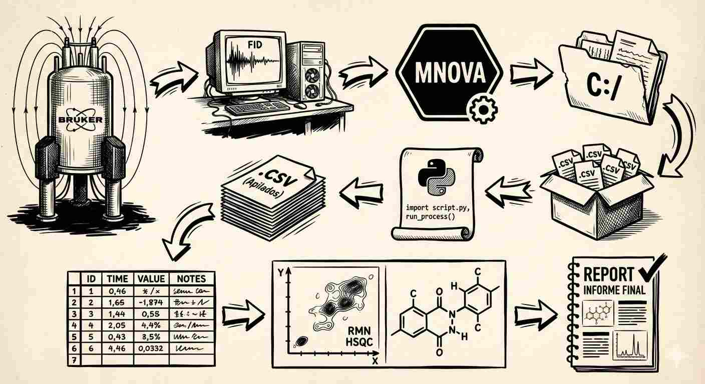
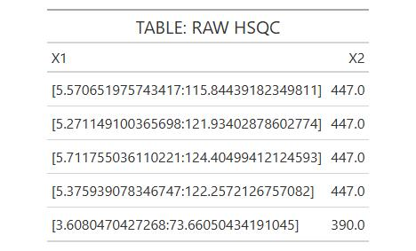
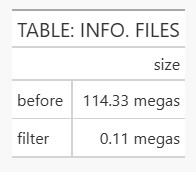

# group-nmr-project

Welcome everyone.

The feeling that commercial software in the analytical field presents many barriers is the same feeling I had when processing and reporting analytical results.

**There were real barriers.**

That's why I had to improve my statistical training, which necessarily involved using open-source software like R and Python.

My job responsibilities included analyzing the NMR spectra of complex carbohydrates that we obtained. These were processed individually and elucidated—quantified using the tools available in the software.
Commercial software does not have the option to add information to the sample, such as the company that manufactured it or any information important to obtain an inference analysis of a population 'n' against other populations or the use of basic models or advanced models such as machine learning and its metrics (mae, rmse...).

In addition, open-source programs offer the opportunity for anyone to:

1.  reproduce the results

2.  validate the data

3.  be transparent and unmodifiable.

> works under GMP standards

This repository is for HSQC spectra, a major problem I've had to work with, and the learning curve was long, but the solution was simple and clear.

> Just a few lines of code.

The schematic description is

<br>

## 1. OPEN A LARGE COLLECTION HSQC'S SPECTRA

I don't have NMR spectra, but I've worked extensively with them; I know their structure and shape, so I can simulate them.

In the file's `code`, there's a script called `nmr_simulator.py` (Python code) where 15 HSQCs of the cholesterol compound were created with slight variations depending on the manufacturer and the introduction of a cholesterol-propyl compound as an impurity `cholesterol-05C`.

The simulated HSQCs have the same structure as a real HSQC and are saved in formats available in the MNova software: `.txt` or `.csv`.

The results are 15 HSQC spectra of size 8 megas each. The table and figure below show 5 rows of the greated csv file and the resulting HSQC.

<table style="width: 100%;">
  <tr>
    <td align="center" style="width: 50%;">
      
      <br>
      <b>Table 1: Raw HSQC</b>
    </td>
    <td align="center" style="width: 50%;">
      
      <br>
      <b>Figure 1: GRAPH: RAW HSQC</b>
    </td>
  </tr>
</table>

<br>

## 2.  AUTOMATIC LOAD & FILTER DATA

With a few simple lines of code, we can open the entire collection of spectra and compact all the information into a simple structure (DataFrame).
The data loading is a simple and smart step where the most times we don't think much but I learn that is the `key point`.
All code is in the `nmr_scrip.py` with 2 important points

### FILES PATH

in `folder_sim` say to PC where is the path your files .csv and in `csv_sim` save in a list all path files, ready to use in a single block

```{python}

folder_sim = Path("database/simulation")

csv_sim = list(folder_sim.glob("*.csv"))

```
<a name="sec-lo0p"></a>
### LOOP TO CREATE A DATAFRAME + 1^ST^ AND POWERFUL FILTER {#sec-lop}

In the loop say that each path file in the list `csv_sim` + open, filter intensity up 50 (drop negative and small signal ~ noise) + id each file + stack all files in a single and easy structure *DataFrame*. trere are more steps but the previous steps are very powerful

```{python}

df_list = []

for file in csv_sim:
    temp_df = pd.read_csv(file) ### load each simulated nmr file
    temp_df = temp_df[temp_df['intensity'] > 50] ### filter low intensity peaks
    temp_df['id'] = file.stem ### add an id column based on file name
    df_list.append(temp_df)  ### append to list

```

<br>

## 3.  FILTER & REDUCE THE SIZE

With our DataFrame and other simple lines of code (#sec- loop) (#sec-lop) , we can reduce file sizes and improve tables for data analysis and the automatic elucidation and integration of custom spectra. The table and figure below show 5 rows of the sorted table and the new resulting HSQC free to noise.

<table border="0">
  <tr>
    <!-- Left Column: Table -->
    <td valign="top" width="50%">

| file | size (mb) |
| :--- | :--- |
| before | 114.33 |
| filter | 0.11 |

<p align="center"><b>Table 1: File Size Comparison</b></p>
    </td>
    <!-- Right Column: Image -->
    <td valign="top" width="50%" align="center">
      
      <br>
      <b>Figure 2: GRAPH: FILTER HSQC</b>
    </td>
  </tr>
</table>


At this point it should be noted that the information is reduced from more than 100 to 0.1 megabytes.

<table style="width: 100%;">
  <tr>
    <td align="center" style="width: 50%;">
      
      <br>
      <b>Table 3: TABLE: INFO. FILES</b>
    </td>
    <td align="center" style="width: 50%;">
      
      <br>
      <b>Figure 2: Column graph reduction size of HSQC files</b>
    </td>
  </tr>
</table>
<br>

## 4.  OPEN IN A SIMPLE DATASET

{#fig-dataset}

## 5.  elucidate the compound

## 6.  integrate and quantify.
