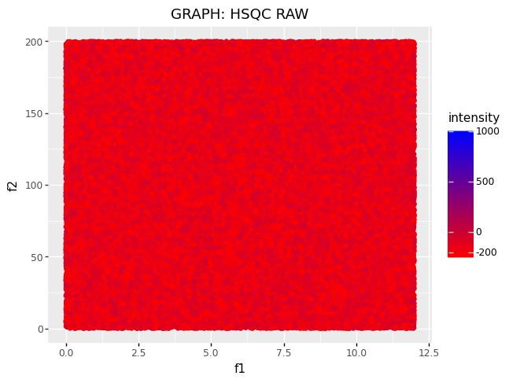
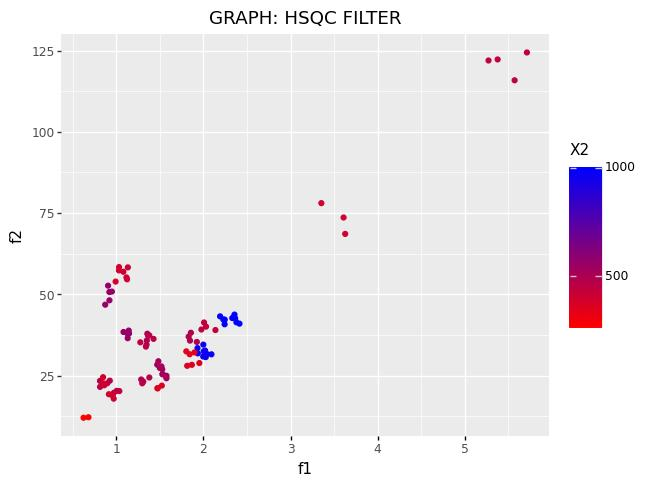
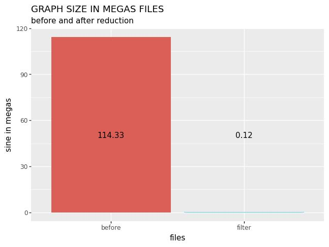
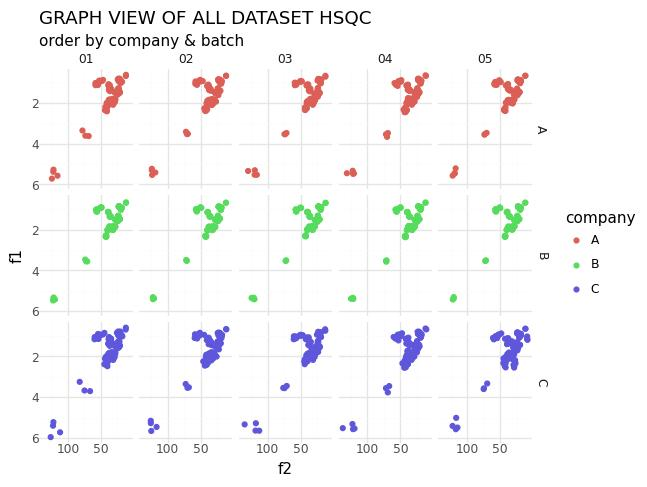

# group-nmr-project

Welcome everyone. I want to create a code to manipulate a nmr collection

The idea is:

1.  open a large collection of nmr of HSQC

I don't have NMR spectra but I have worked so much with them and know its structure and form and I can simulated. In the file `code` there is a script `nmr_simulator.py` where in *python* code create 15 *HSQC* with the same structure that a real HSQC save in **MNova** software in format `.txt` or .csv

2. to do a list

3. reduce the size the files

  
  
   
  <em>Caption 1 HSQC without manipulated;&nbsp;&nbsp;&nbsp;&nbsp;&nbsp;&nbsp;&nbsp;&nbsp; Caption 2 HSQC filter</em>

  
  
   
  <em>Caption 1 Column graph reduction size of HSQC files;&nbsp;&nbsp;&nbsp;&nbsp;&nbsp;&nbsp;&nbsp;&nbsp; Caption 2 All HSQC spectra</em>

