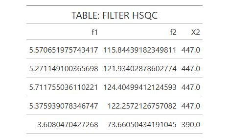

# group-nmr-project

Welcome everyone.

The feeling that commercial software in the analytical field presents many barriers is the same feeling I had when processing and reporting analytical results.

**There were real barriers.**

That's why I had to improve my statistical training, which necessarily involved using open-source software like R and Python.

My job responsibilities included analyzing the NMR spectra of complex carbohydrates that we obtained. These were processed individually and elucidated—quantified using the tools available in the software.

Commercial software does not have the option to add information to the sample, such as the company that manufactured it or any information important to obtain an inference analysis of a population 'n' against other populations or the use of basic models or advanced models such as machine learning and its metrics (mae, rmse...).

In addition, open-source programs offer the opportunity for anyone to:

1.  reproduce the results

2.  validate the data

3.  be transparent and unmodifiable.

> works under GMP standards

This repository is for HSQC spectra, a major problem I've had to work with, and the learning curve was long, but the solution was simple and clear.

> Just a few lines of code.

The schematic description is

## 1. OPEN A LARGE COLLECTION HSQC'S SPECTRA

I don't have NMR spectra, but I've worked extensively with them; I know their structure and shape, so I can simulate them.

In the file's `code`, there's a script called `nmr_simulator.py` (Python code) where 15 HSQCs of the cholesterol compound were created with slight variations depending on the manufacturer and the introduction of a cholesterol-propyl compound as an impurity `cholesterol-05C`.

The simulated HSQCs have the same structure as a real HSQC and are saved in formats available in the MNova software: `.txt` or `.csv`.

 

The results are HSQC spectra of size 8 megas and spectrum with noise

<table style="width: 100%;">
  <tr>
    <td align="center" style="width: 50%;">
      
       
      <b>Figure 1: Raw HSQC</b>
    </td>
    <td align="center" style="width: 50%;">
      
       
      <b>Figure 2: GRAPH: RAW HSQC</b>
    </td>
  </tr>
</table>

2.  Autamatic load & filter

With a simple lines of code, we can open all spectra collection reduce the files and improve the tables to analysis of data and spectra to elucidation and integration

{#tbl-filter-hsqc width="33%"} {#fig-filter-hsqc width="25%"}

3.  reduce the size the files

With the 2. point reduce the info. from more 100 to 0.1 megas

{#tbl-info width="30%"} {#fig-reduction width="35%"}

4.  open in a simple dataframe

{#fig-dataset}

5.  elucidate the compound

6.  integrate and quantify 6.
